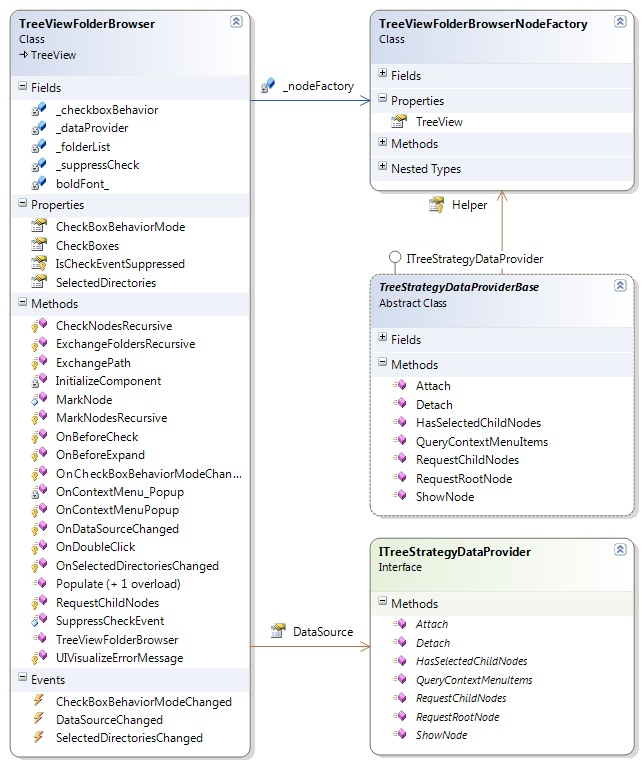
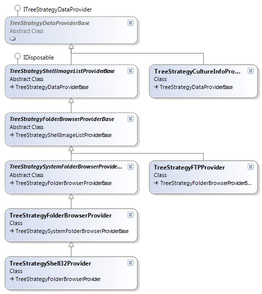

# TreeViewFolderBrowser
Supports Explorer, SingleChecked and RecursiveChecked mode (checkboxes). Lets you specify the displayed drive types etc..

Based on popular demand in the [discussion area](http://www.codeproject.com/Articles/4472/WebControls/#_comments) I've decided to put the latest code out in the wild. 
The software is provided "as is". Bare in mind that this is an early 3.0.0 Version which never made it's way to [codeproject.com](http://codeproject.com).

## Introduction

This tree view control gives you the ability to control which drive types are displayed to let the user choose directories. A possible scenario is to show only local drives, because your Application scan the selected directories and fill a database with the generated meta data, and it makes no sense to allow directories from removable drives.

## Design

### Introduction

This release has a new design which is based on a tree view which aggregates a tree view data provider interface ([Strategy pattern](http://www.microsoft.com/resources/practices/completelist.asp)). The goal of the new design is to provide an easy way to extend or add data providers without changing a single line of tree view code. Basically the tree view interface will not change so far, but the data providers will change their behavior and features.

`TreeViewFolderBrowser` class defines the following core requirements

*   DriveTypes
*   RootFolder
*   CheckboxBehaviorMode

and is responsible to manage the checkboxes and the internal selected directories list.

`ITreeViewFolderBrowserDataProvider` is used by a`TreeViewFolderBrowser` instance and is responsible to
*   retrieve the computer drives and directories
*   Imagelist which is used to assign images to the nodes created by this instance
*   ContextMenu

and can provide custom features and behavior to extend the`TreeViewFolderBrowser` class.

### TreeViewFolderBrowser

You can specify the drive types through a public instance property on the control. The enumeration can be treated as a bit field, that is, a set of flags.

<table id="table2" cellspacing="0" class="dtTABLE"><tbody><tr valign="top"><th width="50%">Member Name</th><th width="50%">Description</th></tr><tr valign="top"><td width="50%">**NoRootDirectory**</td><td width="50%">NoRootDirectory</td></tr><tr valign="top"><td width="50%">**RemovableDisk**</td><td width="50%">Drive has removable media. This includes all floppy drives and many other varieties of storage devices.</td></tr><tr valign="top"><td width="50%">**LocalDisk**</td><td width="50%">Drive has fixed (nonremovable) media. This includes all hard drives, including hard drives that are removable.</td></tr><tr valign="top"><td width="50%">**NetworkDrive**</td><td width="50%">Network drives. This includes drives shared anywhere on a network.</td></tr><tr valign="top"><td width="50%">**CompactDisc**</td><td width="50%">Drive is a CD-ROM. No distinction is made between read-only and read/write CD-ROM drives.</td></tr><tr valign="top"><td width="50%">**RAMDisk**</td><td width="50%">Drive is a block of Random Access Memory (RAM) on the local computer that behaves like a disk drive.</td></tr></tbody></table>

The different CheckboxBehaviorMode indicates whether check boxes are displayed next to the tree nodes in the tree view control and how the tree view handle related events. The main difference between SingleChecked and RecursiveChecked behavior, lies in the fact that the user can't unselect sub folders of a checked folder in RecursiveChecked mode.  

<table id="table3" cellspacing="0" class="dtTABLE"><tbody><tr valign="top"><th style="BORDER-RIGHT: #999999 0px solid; PADDING-RIGHT: 6px; BORDER-TOP: #999999 0px solid; PADDING-LEFT: 6px; PADDING-BOTTOM: 4px; BORDER-LEFT: #999999 1px solid; PADDING-TOP: 4px; BORDER-BOTTOM: #999999 1px solid; TEXT-ALIGN: left" width="50%">Member Name</th><th style="BORDER-RIGHT: #999999 0px solid; PADDING-RIGHT: 6px; BORDER-TOP: #999999 0px solid; PADDING-LEFT: 6px; PADDING-BOTTOM: 4px; BORDER-LEFT: #999999 1px solid; PADDING-TOP: 4px; BORDER-BOTTOM: #999999 1px solid; TEXT-ALIGN: left" width="50%">Description</th></tr><tr valign="top"><td style="BORDER-RIGHT: #999999 0px solid; PADDING-RIGHT: 6px; BORDER-TOP: #999999 0px solid; PADDING-LEFT: 6px; PADDING-BOTTOM: 4px; BORDER-LEFT: #999999 1px solid; PADDING-TOP: 4px; BORDER-BOTTOM: #999999 1px solid; TEXT-ALIGN: left" width="50%">**None**</td><td style="BORDER-RIGHT: #999999 0px solid; PADDING-RIGHT: 6px; BORDER-TOP: #999999 0px solid; PADDING-LEFT: 6px; PADDING-BOTTOM: 4px; BORDER-LEFT: #999999 1px solid; PADDING-TOP: 4px; BORDER-BOTTOM: #999999 1px solid; TEXT-ALIGN: left" width="50%">**No check boxes**are displayed next to the tree nodes in the tree view control.</td></tr><tr valign="top"><td style="BORDER-RIGHT: #999999 0px solid; PADDING-RIGHT: 6px; BORDER-TOP: #999999 0px solid; PADDING-LEFT: 6px; PADDING-BOTTOM: 4px; BORDER-LEFT: #999999 1px solid; PADDING-TOP: 4px; BORDER-BOTTOM: #999999 1px solid; TEXT-ALIGN: left" width="50%">**SingleChecked**</td><td style="BORDER-RIGHT: #999999 0px solid; PADDING-RIGHT: 6px; BORDER-TOP: #999999 0px solid; PADDING-LEFT: 6px; PADDING-BOTTOM: 4px; BORDER-LEFT: #999999 1px solid; PADDING-TOP: 4px; BORDER-BOTTOM: #999999 1px solid; TEXT-ALIGN: left" width="50%">**Check boxes**are displayed next to the tree nodes in the tree view control. The user can check directories.</td></tr><tr valign="top"><td style="BORDER-RIGHT: #999999 0px solid; PADDING-RIGHT: 6px; BORDER-TOP: #999999 0px solid; PADDING-LEFT: 6px; PADDING-BOTTOM: 4px; BORDER-LEFT: #999999 1px solid; PADDING-TOP: 4px; BORDER-BOTTOM: #999999 1px solid; TEXT-ALIGN: left" width="50%">**RecursiveChecked**</td><td style="BORDER-RIGHT: #999999 0px solid; PADDING-RIGHT: 6px; BORDER-TOP: #999999 0px solid; PADDING-LEFT: 6px; PADDING-BOTTOM: 4px; BORDER-LEFT: #999999 1px solid; PADDING-TOP: 4px; BORDER-BOTTOM: #999999 1px solid; TEXT-ALIGN: left" width="50%">**Check boxes** are displayed next to the tree nodes in the tree view control. The user can check directories, the**subdirectories are checked recursive**.</td></tr></tbody></table>

The root folder property let you specify where the browsing starts from. Root folder values are defined by`System.Environment.SpecialFolder`.

<table id="table4" cellspacing="0" class="dtTABLE"><tbody><tr valign="top"><th style="BORDER-RIGHT: #999999 0px solid; PADDING-RIGHT: 6px; BORDER-TOP: #999999 0px solid; PADDING-LEFT: 6px; PADDING-BOTTOM: 4px; BORDER-LEFT: #999999 1px solid; PADDING-TOP: 4px; BORDER-BOTTOM: #999999 1px solid; TEXT-ALIGN: left" width="50%">Member Name</th><th style="BORDER-RIGHT: #999999 0px solid; PADDING-RIGHT: 6px; BORDER-TOP: #999999 0px solid; PADDING-LEFT: 6px; PADDING-BOTTOM: 4px; BORDER-LEFT: #999999 1px solid; PADDING-TOP: 4px; BORDER-BOTTOM: #999999 1px solid; TEXT-ALIGN: left" width="50%">Description</th></tr><tr valign="top"><td style="BORDER-RIGHT: #999999 0px solid; PADDING-RIGHT: 6px; BORDER-TOP: #999999 0px solid; PADDING-LEFT: 6px; PADDING-BOTTOM: 4px; BORDER-LEFT: #999999 1px solid; PADDING-TOP: 4px; BORDER-BOTTOM: #999999 1px solid; TEXT-ALIGN: left" width="50%">**Desktop**</td><td style="BORDER-RIGHT: #999999 0px solid; PADDING-RIGHT: 6px; BORDER-TOP: #999999 0px solid; PADDING-LEFT: 6px; PADDING-BOTTOM: 4px; BORDER-LEFT: #999999 1px solid; PADDING-TOP: 4px; BORDER-BOTTOM: #999999 1px solid; TEXT-ALIGN: left" width="50%">The tree view control shows a virtual desktop root node. Personal node points to the user my files folder. The MyComputer node shows the**specified drive types**.</td></tr><tr valign="top"><td style="BORDER-RIGHT: #999999 0px solid; PADDING-RIGHT: 6px; BORDER-TOP: #999999 0px solid; PADDING-LEFT: 6px; PADDING-BOTTOM: 4px; BORDER-LEFT: #999999 1px solid; PADDING-TOP: 4px; BORDER-BOTTOM: #999999 1px solid; TEXT-ALIGN: left" width="50%">**MyComputer**</td><td style="BORDER-RIGHT: #999999 0px solid; PADDING-RIGHT: 6px; BORDER-TOP: #999999 0px solid; PADDING-LEFT: 6px; PADDING-BOTTOM: 4px; BORDER-LEFT: #999999 1px solid; PADDING-TOP: 4px; BORDER-BOTTOM: #999999 1px solid; TEXT-ALIGN: left" width="50%">The tree view control shows the**specified drive types** on the root.</td></tr><tr valign="top"><td style="BORDER-RIGHT: #999999 0px solid; PADDING-RIGHT: 6px; BORDER-TOP: #999999 0px solid; PADDING-LEFT: 6px; PADDING-BOTTOM: 4px; BORDER-LEFT: #999999 1px solid; PADDING-TOP: 4px; BORDER-BOTTOM: #999999 1px solid; TEXT-ALIGN: left" width="50%">All other values from`System.Environment.SpecialFolder`</td><td style="BORDER-RIGHT: #999999 0px solid; PADDING-RIGHT: 6px; BORDER-TOP: #999999 0px solid; PADDING-LEFT: 6px; PADDING-BOTTOM: 4px; BORDER-LEFT: #999999 1px solid; PADDING-TOP: 4px; BORDER-BOTTOM: #999999 1px solid; TEXT-ALIGN: left" width="50%">The tree view control shows the specified root folder, the**drive types are ignored**.</td></tr></tbody></table>

The combination of`DriveType`,`CheckboxBehaviorModes` and`SpecialFolder` enumeration values gives you the ability to control how the tree view display it's content and behaves when you select a directory.

### DataProvider

Data providers are the workers behind the`TreeViewFolderBrowser` which controls them. By implementing the`ITreeViewFolderBrowserDataProvider` interface, you will have full control over the core processes like retrieving data, assign images to the nodes and provide custom`ContextMenu` items for each node. But you don't have to care about checkboxes, load on demand, find node at position if the user request the`ContextMenu`, you will be hooked if it's time to take some action on it. The only thing you must respect is the core functionality (DriveTypes and RootFolder) implemented by the`TreeViewFolderBrowser.`

To provide clean access to the handled`TreeViewFolderBrowser` class instance every method on the data provider interface provides an`TreeViewFolderBrowserHelper` class instance which lets you create nodes and give you access to the`TreeViewFolderBrowser` instance.

Please take a look at the two delivered standard implementations which can be found in the`Raccoom.TreeViewFolderBrowser.DataProviders` project.

## Key features

### TreeViewFolderBrowser

*   Different build in CheckboxBehaviorModes.
*   Step by step population for subdirectories.
*   Parent nodes are bold if there are selected subfolders, this helps to find selected directories in large structures.

### TreeViewFolderBrowserDataProvider

*   Drive enumeration through strong typedWin32_Logicaldisk**[WMI](http://msdn.microsoft.com/library/default.asp?url=/library/en-us/wmisdk/wmi/win32_logicaldisk.asp)**class.
*   Shell32 ImageList used to retrieve Icons.
*   System.IO namespace used to retrieve directories
*   Respects the code access security features from .NET

### TreeViewFolderBrowserDataProviderShell32

Inherit from TreeViewFolderBrowserDataProvider

*   Drive and directory enumeration through Shell32 interop against strong typedWin32_Logicaldisk**[WMI](http://msdn.microsoft.com/library/default.asp?url=/library/en-us/wmisdk/wmi/win32_logicaldisk.asp)**class drive types. (Does not respect .NET code access security)
*   Supports Shell32 virtual folders (non file system folders)
*   Shell32 ImageList used to retrieve Icons.
*   Functional context menu items for each shell object.
*   Tested against WinXP and Win2000\.

## Using the code

Before you begin make sure your project has a valid reference to the Raccoom.TreeViewFolderBrowser.dll. Go to the Toolbox window, right-click and select Customize Toolbox from the context menu. In the Customize Toolbox dialog go to the .NET Framework Components tab and select the Raccoom.TreeViewFolderBrowser.dll assembly that you just compiled. Now drop the TreeViewFolderBrowser control to your form.

This example assumes that you have created an instance of a TreeViewFolderBrowser control on a Form.

**Fill data**

<pre lang="cs">// set standard data provider

this.myTreeView.DataSource = 
 new Raccoom.Windows.Forms.TreeViewFolderBrowserDataProvider();
// set drive types

this.myTreeView.DriveTypes
= DriveTypes.LocalDisk | DriveTypes.NetworkDrive | 
 DriveTypes.RemovableDisk |
 DriveTypes.CompactDisc;
// set checkbox behavior mode

this.myTreeView.CheckboxBehaviorMode= CheckboxBehaviorMode.SingleChecked;
// fill root level

this.myTreeView.Populate();</pre>**Event Handling**<pre lang="cs">private void treeView_SelectedDirectoriesChanged(
 object sender, Raccoom.Windows.Forms.SelectedDirectoriesChangedEventArgse)
{
// determine the path which is currently added (checked) 

// or removed (unchecked)

this.statusBar1.Text = e.Path + " is now " + e.CheckState.ToString();
// display all selected path's in a listbox

this.listBox1.Items.Clear();
foreach(string s in myTreeView.SelectedDirectories)
{
this.listBox1.Items.Add(s);
} 
}
</pre>
## Remarks

This control display drive types and folders, so far so good. Removable disk's can change their medium and folders can change (new folder, delete folder) during run time, the control does not care about that.
